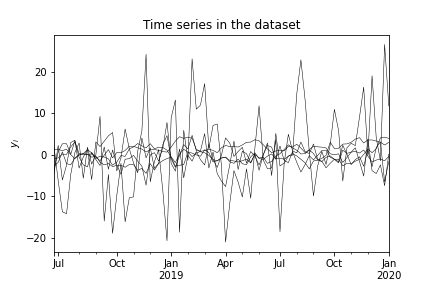
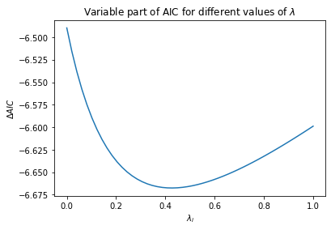
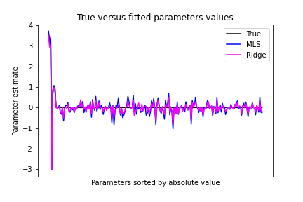
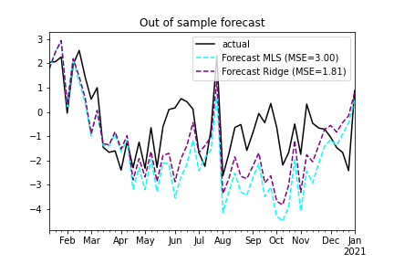

# ridge-VARX


*Class VAR_fs.RidgeVARX*  

Author: **Frederik Stroes**.

```console
pip install git+https://github.com/fstroes/ridge-varx.git
```

```Python3+
RidgeVARX(self, endog, exog=None).fit(lags, deterministic_terms=('constant',), ridge_penalty=None, standardize=None, solver_kwargs=None)
```

This package allows the VARX model to be fitted using Ridge regularization. Ridge regularization allows for better out of sample performance of models fitted on finite samples. And using Ridge, a model can be fitted even if there are more explanatory variables than data points in the sample. Due to the known closed form solution of the estimation criterion, the model is efficiently estimated.

Theory underlying the model and its parameter estimation, together with references can be found in the [model estimation pdf](https://docs.google.com/viewer?url=https://github.com/fstroes/ridge-varx/raw/main/model_estimation_ridge_varx.pdf). A practical example of using the model on a synthetic dataset can be found in the [code_example notebook](https://github.com/fstroes/ridge-VARX/blob/main/code_example.ipynb)

# This package offers:

### Simultaneous modelling of multiple time series
    

### Ridge tuning using AIC
    

### Reduction of noise in the parameter estimates
    

### Improved out of sample forecasting



## Parameters
**endog:** pd.DataFrame, A dataframe containing time series data endogenous variables  
**exog:** object, default=None, A dataframe containing time series data for the exogenous variables

<span style="background-color: aliceblue; color:black">*The input data should be regularly spaced and ordered time series data. It is advisable to use a pd.PeriodIndex type index.*</span>

### Returns 

RidgeVarX object

## Methods:
fit(lags, deterministic_terms=('constant',), ridge_penalty=None, standardize=None) 

### Parameters of the fit method
**deterministic_terms:** object, None or tuple of deterministic terms to use. default=('constant',)   

<span style="background-color: aliceblue; color:black">Currently only ('constant',) is supported, other deterministic terms can however be added as columns of the exogenous dataset.</span>

**ridge_penalty:** Float, default=None, ridge penalty to use if supplied

**standardize:** Object, default is None, automatically set to True if a ridge penalty is supplied, but this behavior can be overwritten by supplying a Boolean.

### Returns

ModelFit: Fitted model class

## Methods of the fitted model class
forecast(exog_future, h)

### Parameters of the forecast method
**exog_future:** pd.DataFrame, A dataframe with an index equivalent to that of **exog** supplied to the model class, with all future values of the exogenous in the period that needs to be forecasted.

**h:** Integer, the number of periods to forecast into the future 

### Returns
pd.DataFrame, Original data with forecast of specified length h appended


# Attributes

* **params**: The fitted parameters of the model. If 'standardize' was set to True, these parameters are the parameters fitted on the standardized data.
* **signal:** The models in sample prediction of the levels data, even when standardization is used
* **p_vals:** The p-values of the parameter estimates under the assumption of correct model specification
* **z_vals:** The standardized parameter estimates (standardized by the estimated variance of their estimators)
* **Y, Z, B:** The Y, Z and B matrices respectively
* **n_stat_units:** The number of statistical units used in fitting the model (T-max(p))
* **error_var:** The variance of the model innovations corrected for the model degrees of freedom k
* **error_var_unadjusted:** The uncorrected variance of the model innovations
* **k:** The number of endogenous variables
* **m:** The number of exogenous variables
* **n_p:** The number of lags of the endogenous
* **k_det:** The number of deterministic terms including the constant term
* **k_per_eq:** (self.n_p * self.k + self.m + self.k_det) * self.k The total number of model parameters (degrees of freedom)
* **K:** (self.n_p * self.k + self.m + self.k_det) * self.k The total number of model parameters
* **g_df:** generalized degrees of freedom used in modelling each equation in case of ridge regularization, similar to k_per_eq
* **diff_AIC:** The variable part of Akaike's information criterion given two models fitted on the same sample


